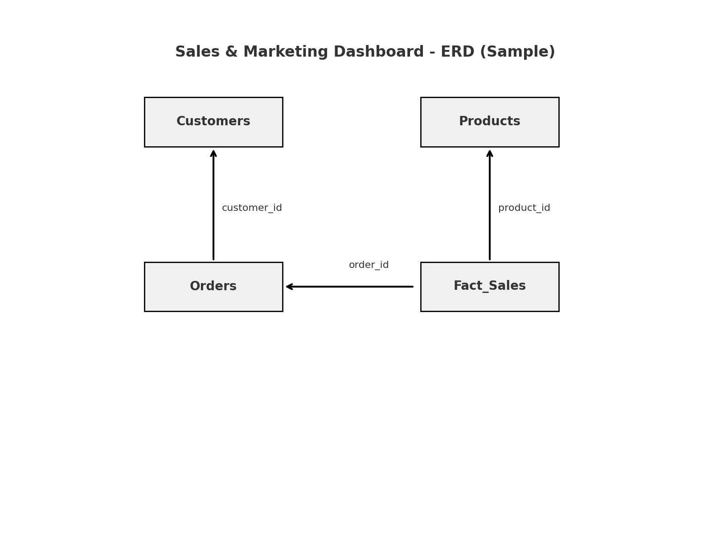

# Sales & Marketing Dashboard

🚀 A lightweight starter project for building a **Sales & Marketing Analytics Dashboard**.  
Includes sample CSVs, SQL scripts, and KPI definitions (Revenue, Orders, AOV, Customer Segmentation).  

---

## 📊 Tech Stack
- SQL (MySQL / PostgreSQL / Snowflake)
- Tableau / Power BI / Excel
- Python (optional, for ETL scripting)

---

## 📂 Project Structure
sales-marketing-dashboard/
data/
customers.csv
products.csv
orders.csv
sql/
01_create_schema.sql
02_clean_dim_customers.sql
03_fact_sales.sql
README.md

## 🗂 ERD (Entity Relationship Diagram)




## Flow
1. Load CSVs into your DB (MySQL/Postgres/BigQuery/Snowflake).
2. Run `sql/01_create_schema.sql` then `sql/02_clean_dim_customers.sql` and `sql/03_fact_sales.sql`.
3. Connect Tableau / Power BI to `analytics.fact_sales` and build visuals (Revenue, AOV, Conversion, CAC proxy).


---

##  KPIs
- **Revenue** (daily/weekly/monthly)
- **Orders** & **Average Order Value (AOV)**
- **New vs Returning Customers**
- **Simple Funnel:** sessions → orders (if web data is added later)

---

##  How to Use
1. Load the sample CSVs into your database.
2. Run the SQL scripts in order (`01_create_schema.sql`, `02_clean_dim_customers.sql`, `03_fact_sales.sql`).
3. Connect Tableau or Power BI to the `analytics.fact_sales` table.
4. Build dashboards for Revenue, AOV, and Customer Segmentation.

---

##  Next Steps
- Replace sample data with real company sales data.
- Extend pipeline to include marketing spend and CAC.
- Add visualization screenshots in this README.

---

**Note:** This repo is a starter template I use to demonstrate ETL + Analytics + Dashboard workflows for hackathons and portfolio projects.


## Repo Structure
```
sales-marketing-dashboard/
  data/
    customers.csv
    products.csv
    orders.csv
  sql/
    01_create_schema.sql
    02_clean_dim_customers.sql
    03_fact_sales.sql
  README.md
```


## Notes
- The CSVs are tiny sample data to test your pipeline.
- Replace with your real data when ready.
