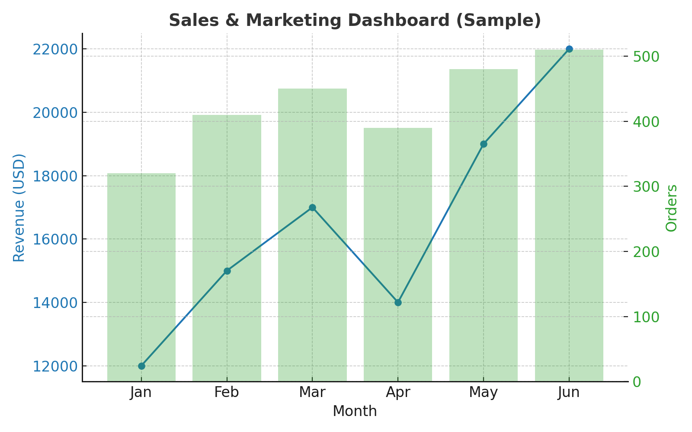

# Sales & Marketing Dashboard

A lightweight starter project for building a **Sales & Marketing Analytics Dashboard**.  
Includes sample CSVs, SQL scripts, and KPI definitions (Revenue, Orders, AOV, Customer Segmentation).  

---

## Tech Stack
- SQL (MySQL / PostgreSQL / Snowflake)
- Tableau / Power BI / Excel
- Python (optional, for ETL scripting)

---

## 📂 Project Structure
sales-marketing-dashboard/
data/
customers.csv
products.csv
orders.csv
sql/
01_create_schema.sql
02_clean_dim_customers.sql
03_fact_sales.sql
README.md

---

##  KPIs
- **Revenue** (daily/weekly/monthly)
- **Orders** & **Average Order Value (AOV)**
- **New vs Returning Customers**
- **Simple Funnel:** sessions → orders (if web data is added later)

---

##  How to Use
1. Load the sample CSVs into your database.
2. Run the SQL scripts in order:
   - `01_create_schema.sql`
   - `02_clean_dim_customers.sql`
   - `03_fact_sales.sql`
3. Connect Tableau or Power BI to the `analytics.fact_sales` table.
4. Build dashboards for Revenue, AOV, and Customer Segmentation.

---

## 📊 Example Dashboard
Here’s a sample visualization :

)

---

##  Next Steps
- Replace sample data with real sales/marketing data.
- Add marketing spend + CAC metrics.
- Extend with customer segmentation & retention analysis.
